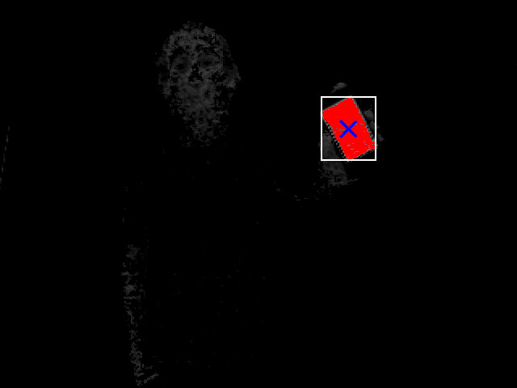
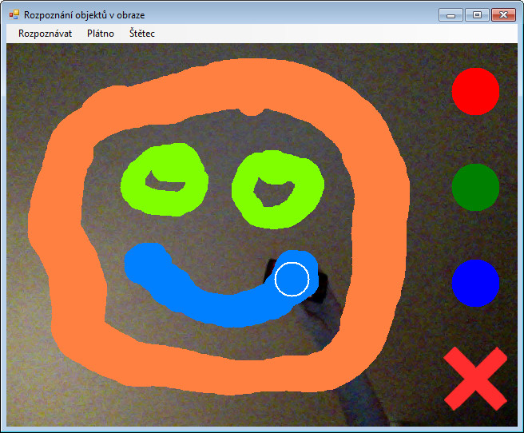

Rozpoznávání objektu v obraze
========================

Analýza snímků z webkamery, rozpoznání objektu v obraze podle barvy a sledování jeho pohybu.

## Demonstrace algoritmu

Tato aplikace pro kreslení umí využít vaší webkamery ke snímání obrazu. Pohybem jakéhokoliv červeného, zeleného nebo modrého objektu se určuje pozice štětce. Můžete tak kreslit přímo do okna webkamery obrazce, měnit barvu a šířku štětce. Nakreslený obrázek můžete vymazat a začít s kreslením od znova.

## Spuštění

Ve složce `MaturitniProjekt` naleznete projekt, který pomocí Visual Studia můžete zkompilovat.

Před spuštěním aplikace se ujistěte, že máte alespoň jednu webkameru připojenou
k počítači. Musíte mít nainstalován `.NET Framework 4`. Dále budete potřebovat červený, zelený nebo modrý předmět, nejlépe barevně svítící.

Ve stejné složce jako spustitelný `.exe` soubor musí být také přiloženy soubory s potřebnými knihovnami (pro připojení k webkameře). Tyto soubory `DirectShowLib-2005.dll` a `MCSystem.dll` naleznete ve složce `MCSystem`.

